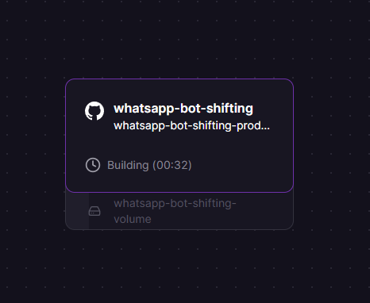
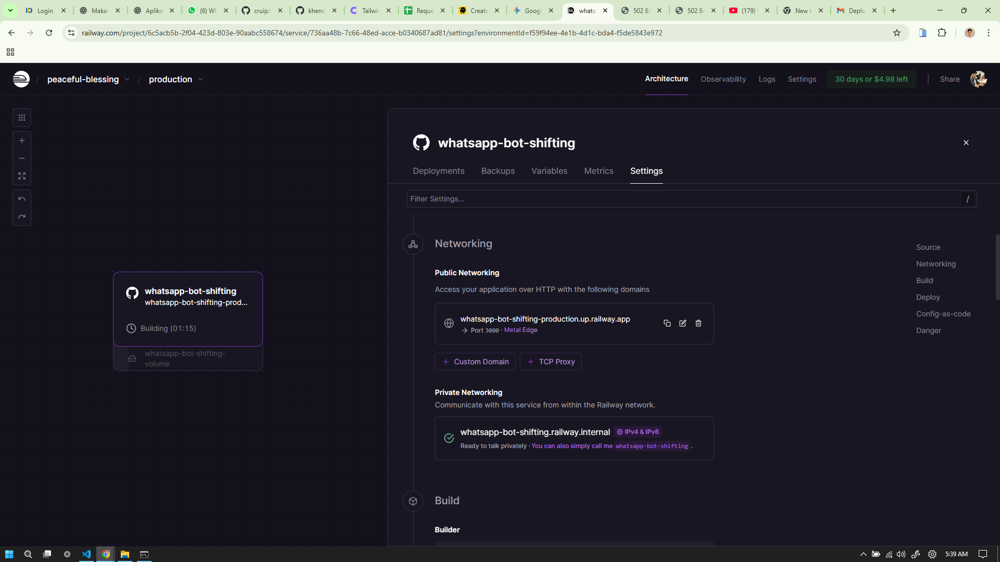
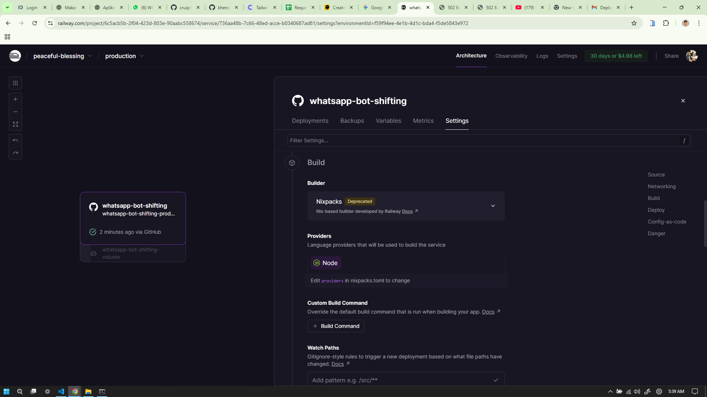
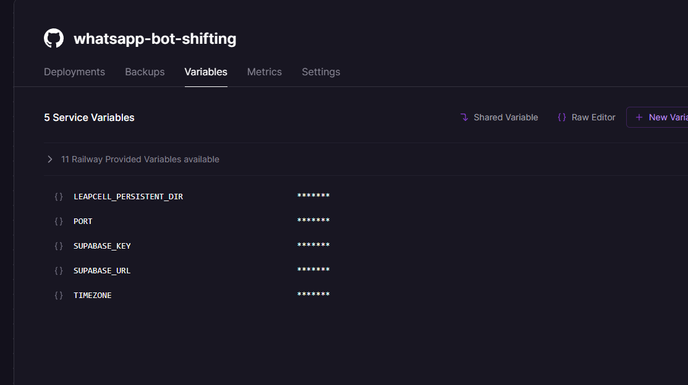

# 💬 WhatsApp Bot Shifting

Bot WhatsApp otomatis yang dapat dijalankan di **Railway**.  
Dokumen ini berisi panduan lengkap untuk melakukan **deploy** ke Railway beserta konfigurasi yang dibutuhkan.

---

## 🚀 Panduan Deploy ke Railway

Berikut langkah-langkah untuk men-deploy bot WhatsApp ini ke Railway.

---

### 1. 🧩 Persiapan File Konfigurasi

Pastikan file berikut sudah ada dan benar sebelum melakukan push ke GitHub.

---

#### A. `package.json` (Start Script)

Pastikan script **start** menggunakan `node` (bukan `nodemon`) dan **tidak** menyertakan `--env-file`.  
Railway akan otomatis menyuntikkan environment variables.

```json
"scripts": {
  "start": "node src/index.js",
  "dev": "nodemon --env-file=.env src/index.js"
},
"engines": {
  "node": ">=20.0.0"
}

```

--- 
#### B. nixpacks.toml

Buat file nixpacks.toml di folder root proyek.
File ini akan menginstal library sistem yang dibutuhkan oleh Whatsapp.js.
---

[phases.setup]
# Menambahkan library sistem yang dibutuhkan oleh Puppeteer/Chromium
aptPkgs = [
  "chromium",
  "libnss3",
  "libatk1.0-0",
  "libatk-bridge2.0-0",
  "libcups2",
  "libgtk-3-0",
  "libgbm-dev",
  "libasound2t64",
  "libgobject-2.0-0"
]


#### C. .gitignore (Keamanan Sesi)
Pastikan kamu mengabaikan folder session agar tidak ter-push ke GitHub.

Cuplikan kode

# Folder sesi WhatsApp
/session/

# File environment
.env

# Folder dependensi
/node_modules/


### 2. Setup di Dashboard Railway
Setelah semua kode di-push ke GitHub:

Setelah kode di-push ke GitHub, lanjutkan langkah-langkah berikut:

🔹 1. Buat Proyek

Buka Railway

Klik New Project

Hubungkan ke repository GitHub kamu

🔹 2. Atur Builder

Masuk ke tab Settings di service kamu

Scroll ke bagian Build

Pastikan Builder diatur ke Nixpacks

🔹 3. Tambahkan Environment Variables

Buka tab Variables

Tambahkan semua environment variable, terutama:

SUPABASE_URL → URL proyek Supabase kamu

SUPABASE_KEY → Kunci API Supabase kamu

🔹 4. Tambahkan Volume (Wajib)

Buka tab Settings

Scroll ke bagian Volumes

Klik Add Volume (atau New Volume)

Isi Mount Path dengan:

./session


Tekan Enter untuk menyimpan

🔹 5. Buat URL Publik

Masuk ke tab Settings

Scroll ke bagian Networking

Klik Generate Domain
(Railway akan membuat domain publik untuk aplikasi kamu)


